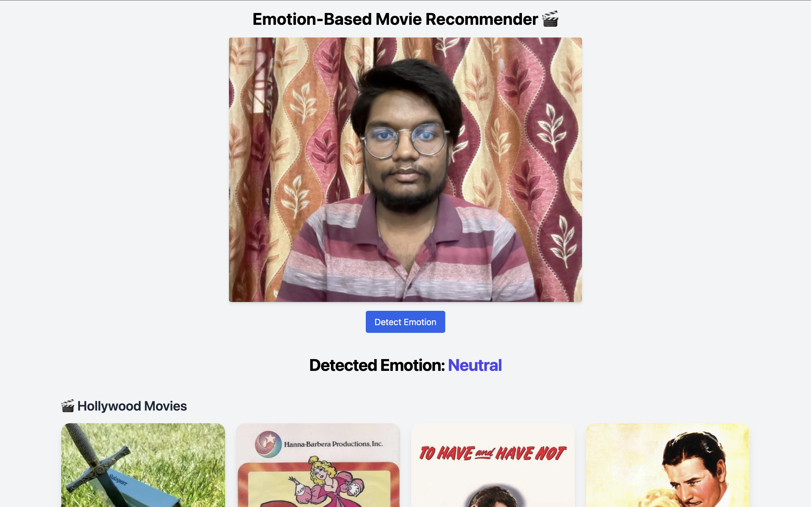

# 🎭 **Falacie-s: Emotion-Based Movie Recommendation System**

**Falacie-s** is an AI-powered movie recommendation platform that detects human emotions through facial expressions and suggests movies that match your current mood — all in real-time.

---

## 🚀 **Features**

- 😄 **Emotion Detection:** Captures facial expressions via webcam and detects emotions using **DeepFace**.
- 🎬 **Personalized Recommendations:** Suggests movies aligned with your detected mood.
- 🌐 **Multilingual Support:** Recommends both **Bollywood (Hindi)** and **Hollywood (English)** films using the **TMDB API**.
- 🧠 **Smart Genre Mapping:** Maps emotions like *happy*, *sad*, *angry*, etc., to specific movie genres.
- 📦 **Scalable Backend:** **FastAPI**-powered backend ensures modularity and performance.
- ⚛️ **Modern Frontend:** Built with **React** and **TailwindCSS** for a sleek, responsive UI.

---

## 📷 Demo
Here’s a preview of Falacie-s in action:



## 🧪 **Tech Stack**

| **Layer**   | **Technologies**                          |
|-------------|--------------------------------------------|
| Frontend    | React, Tailwind CSS                        |
| Backend     | FastAPI                                    |
| ML/AI       | DeepFace (Emotion Detection)               |
| API         | TMDB (The Movie Database)                  |
| Tools       | Python, Node.js, Git                       |

---

## 🔧 **Local Setup**

### 1. **Clone the Repository**

```bash
git clone https://github.com/hridayansh-g/Falacie-s.git
cd Falacie-s
```
### 2. **🛠️ Backend Setup**
```bash
cd backend
python3 -m venv .venv
source .venv/bin/activate
pip install -r requirements.txt

🔑 Create a .env file in the backend/ folder and add your TMDB API key like this:
TMDB_API_KEY=your_tmdb_api_key_here
```
### 3. **🛠️ Frontend Setup**
```bash
cd ../frontend
npm install
npm run dev
```
🔗 That’s it — open http://localhost:5173 to see the app running! 🎉

## 🔒 **Security & Privacy**

- ✅ **.env** files are ignored in Git.
- ✅ **node_modules/** and **.venv/** folders are excluded.
- ✅ **TMDB API key** is safely accessed through environment variables.

---

## 💼 **Perfect For**

- 🧠 **AI/ML Projects & Portfolios**
- 🎞 **Emotion-Aware Recommendation Systems**
- 🌐 **API Integration Demonstrations**
- 🧳 **Job Interviews & Developer Showcases**

---

## 🙌 **Authors**

- **Hridayansh Gupta**
- **Ishita Srivastava**
- **Riya Dwivedi**
- **Lokendra Prajapati**

---

## Youtube Link: https://youtu.be/oadANaaW_RM?si=89TAhvNncimZqBBU
